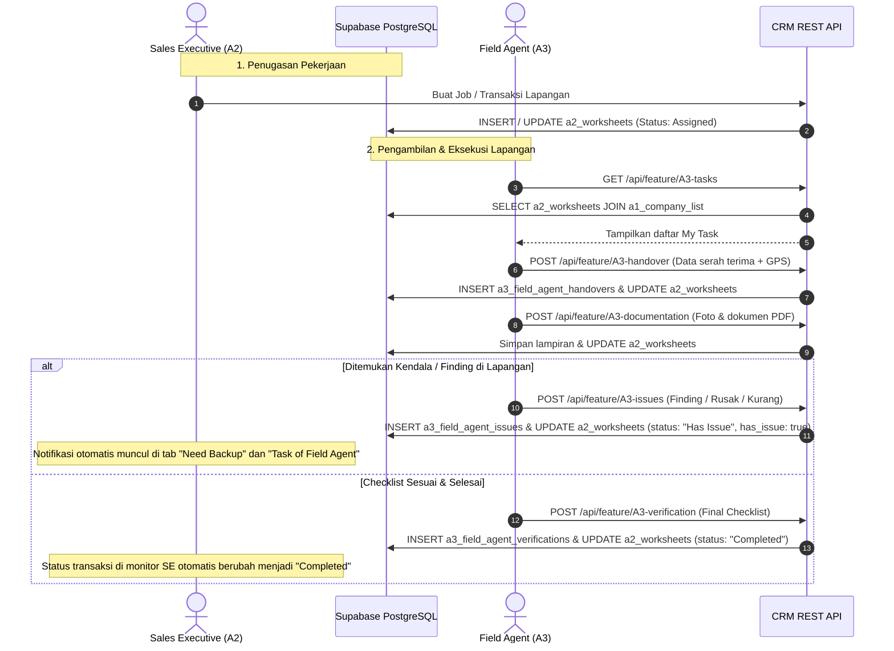

# Alur Kerja & Dokumentasi API: Integrasi Field Agent (A3) & Sales Executive (A2)

Dokumen ini menjelaskan arsitektur alur kerja (*end-to-end workflow*), pemetaan basis data, dan spesifikasi REST API untuk modul **Field Agent (A3)** yang terhubung langsung dengan modul **Sales Executive (A2)** pada sistem CRM Andima Transportindo.

---

## 1. Ikhtisar Arsitektur & Hubungan Antar Modul

- **Sales Executive (Modul A2)**:
  - Mengelola komunikasi pelanggan (*Record Customer Conversation*).
  - Membuat dan menugaskan pekerjaan pengiriman/penjemputan kargo (*Task of Field Agent*).
  - Memantau status pengerjaan secara waktu nyata (*real-time monitoring*).
  - Menerima dan menindaklanjuti eskalasi kendala lapangan (*Need Backup Tab*).

- **Field Agent (Modul A3)**:
  - Berdiri mandiri dengan antarmuka khusus petugas lapangan (`/dashboard/field-agent`).
  - Mengambil daftar tugas yang dialokasikan dari Sales Executive.
  - Melakukan 4 tahapan eksekusi lapangan:
    1. **Detail Job**: Meninjau rincian pengiriman, koli, MAWB/HAWB, dan lokasi.
    2. **Handover**: Merekam data penyerah/penerima, aktual koli/berat, dan validasi koordinat GPS.
    3. **Dokumentasi**: Mengunggah 4 foto wajib dan 2 dokumen wajib (*Packing List* & *Commercial Invoice*).
    4. **Verifikasi**: Melakukan *checklist* kepatuhan visual barang, dokumen, dan regulasi maskapai.
  - Jika ditemukan anomali atau kerusakan, petugas dapat langsung melaporkan *Issue* yang secara otomatis terhubung ke Sales Executive.

---

## 2. Diagram Alur Kerja End-to-End



---

## 3. Pemetaan Basis Data (Database Schema)

Integrasi ini menghubungkan beberapa tabel utama di Supabase PostgreSQL:

| Nama Tabel | Peran Utama | Kunci Penghubung |
| :--- | :--- | :--- |
| `a2_worksheets` | Tabel master transaksi/pekerjaan lapangan yang dibuat oleh Sales Executive | `job_number`, `id` |
| `a1_company_list` | Master data perusahaan/pelanggan | `company_list_id` / `customer_id` |
| `a3_field_agent_handovers` | Rekaman serah terima barang kargo dan koordinat GPS | `job_number` |
| `a3_field_agent_issues` | Rekaman insiden, kendala, atau kerusakan barang dari petugas lapangan | `job_number` |
| `a3_field_agent_verifications` | Rekaman hasil akhir checklist kepatuhan pengiriman | `job_number` |

### Kolom Sinkronisasi Utama pada `a2_worksheets`:
- `status`: `'Draft'` | `'Assigned'` | `'In Progress'` | `'Has Issue'` | `'Completed'`
- `has_issue`: `boolean` (`true` saat ada issue terbuka)
- `delivery_location`: Lokasi serah terima barang
- `planned_pieces` / `planned_gross_weight`: Rencana koli dan berat kargo

---

## 4. Spesifikasi Lengkap REST API

Base URL lokal: `http://localhost:3000`

### 4.1. GET `/api/feature/A3-tasks`
Mengambil seluruh daftar penugasan lapangan untuk Field Agent yang bersumber langsung dari `a2_worksheets`.

- **Method**: `GET`
- **Header**: `Content-Type: application/json`
- **Contoh Request**:
  ```bash
  curl -X GET http://localhost:3000/api/feature/A3-tasks
  ```
- **Contoh Respons (HTTP 200 OK)**:
  ```json
  {
    "success": true,
    "data": [
      {
        "id": "c7e19697-2039-4186-888f-8c937b4df471",
        "job_number": "JOB-JKT-2403",
        "customer_name": "PT Majo Logistics",
        "shipper_name": "PT Global Freight",
        "consignee_name": "PT Indah Karya",
        "mawb_hawb": "215-8812",
        "job_type": "Delivery",
        "planned_pieces": 5,
        "planned_gross_weight": 850,
        "delivery_location": "Terminal Cargo 1, Soekarno-Hatta",
        "status": "In Progress",
        "has_issue": false,
        "created_at": "2026-09-29T21:53:08.70111+00:00",
        "updated_at": "2026-09-29T21:53:08.70111+00:00"
      }
    ]
  }
  ```

---

### 4.2. POST `/api/feature/A3-handover`
Mencatat proses serah terima barang fisik dan validasi lokasi koordinat GPS dari perangkat petugas.

- **Method**: `POST`
- **Header**: `Content-Type: application/json`
- **Payload Request**:
  ```json
  {
    "jobNumber": "JOB-JKT-2401",
    "deliveringParty": "Budi Santoso",
    "receivingParty": "Andi Pratama",
    "actualPieces": 10,
    "actualGrossWeight": 250,
    "location": "Gate 3, Terminal 2, Bandara Soekarno-Hatta",
    "latitude": -6.1275,
    "longitude": 106.6537,
    "accuracy": 4.5
  }
  ```
- **Efek Samping Basis Data**:
  1. Data serah terima disimpan ke tabel `a3_field_agent_handovers`.
  2. Status lembar kerja di `a2_worksheets` diperbarui menjadi `'In Progress'`.
- **Contoh Respons (HTTP 200 OK)**:
  ```json
  {
    "success": true,
    "message": "Handover record saved successfully",
    "data": {
      "job_number": "JOB-JKT-2401",
      "status": "In Progress"
    }
  }
  ```

---

### 4.3. POST `/api/feature/A3-documentation`
Menyimpan daftar berkas foto fisik kargo dan dokumen legalitas pelayaran/penerbangan.

- **Method**: `POST`
- **Header**: `Content-Type: application/json`
- **Payload Request**:
  ```json
  {
    "jobNumber": "JOB-JKT-2401",
    "photos": [
      "Foto_Keseluruhan_Barang.jpg",
      "Marking_Shipping_Label.jpg",
      "Segel_Kontainer.jpg",
      "Area_Pallet.jpg"
    ],
    "documents": [
      "PackingList_DSV.pdf",
      "Invoice_DSV.pdf"
    ]
  }
  ```
- **Contoh Respons (HTTP 200 OK)**:
  ```json
  {
    "success": true,
    "message": "Documentation saved successfully"
  }
  ```

---

### 4.4. POST `/api/feature/A3-issues`
Melaporkan temuan kerusakan (*Damaged Package*), ketidaksesuaian jumlah (*Quantity Mismatch*), dokumen hilang, atau kendala operasional lapangan.

- **Method**: `POST`
- **Header**: `Content-Type: application/json`
- **Payload Request**:
  ```json
  {
    "jobNumber": "JOB-JKT-2410",
    "category": "Damaged Package",
    "classification": "Urgent",
    "description": "Ditemukan 2 kardus kemasan basah dan robek pada sisi palet kanan."
  }
  ```
- **Efek Samping Basis Data**:
  1. Dicatat ke dalam tabel `a3_field_agent_issues`.
  2. Status di `a2_worksheets` langsung diubah menjadi `'Has Issue'` dan kolom `has_issue` diset `true`.
  3. **Real-time Impact**: Tugas langsung muncul di menu **Need Backup** Sales Executive sehingga tim kantor dapat segera mengambil tindakan mitigasi atau konfirmasi ke klien.
- **Contoh Respons (HTTP 200 OK)**:
  ```json
  {
    "success": true,
    "message": "Issue reported and worksheet updated successfully",
    "data": {
      "jobNumber": "JOB-JKT-2410",
      "status": "Has Issue"
    }
  }
  ```

---

### 4.5. POST `/api/feature/A3-verification`
Menyimpan lembar checklist verifikasi akhir kelayakan pengiriman barang sesuai standar maskapai.

- **Method**: `POST`
- **Header**: `Content-Type: application/json`
- **Payload Request**:
  ```json
  {
    "jobNumber": "JOB-JKT-2401",
    "documentVerification": "Sesuai",
    "packageCondition": "Baik",
    "airlineStandard": "Sesuai",
    "dangerousGoods": false,
    "specialHandling": []
  }
  ```
- **Efek Samping Basis Data**:
  1. Catatan verifikasi tersimpan di tabel `a3_field_agent_verifications`.
  2. Status di `a2_worksheets` diperbarui menjadi `'Completed'` dan kolom `has_issue` diset `false`.
- **Contoh Respons (HTTP 200 OK)**:
  ```json
  {
    "success": true,
    "message": "Verification completed and job status marked as Completed",
    "data": {
      "jobNumber": "JOB-JKT-2401",
      "status": "Completed"
    }
  }
  ```

---

## 5. Ringkasan Status Transaksi Lapangan

```
[Draft] -> [Assigned] -> [In Progress]
                               |
            +------------------+------------------+
            |                                     |
            v                                     v
       [Has Issue]                           [Completed]
(Muncul di Need Backup SE)              (Tugas Lapangan Sukses)
            |
            v
 (Diselesaikan / Konfirmasi SE)
```

1. **Assigned**: Transaksi dibuat dan ditugaskan oleh Sales Executive kepada Field Agent.
2. **In Progress**: Petugas lapangan telah mulai memproses (merekam serah terima/GPS).
3. **Has Issue**: Terdapat temuan kendala dari lapangan yang membutuhkan tindak lanjut Sales Executive.
4. **Completed**: Seluruh tahapan handover, foto, dokumen, dan verifikasi checklist telah selesai dan tervalidasi.
