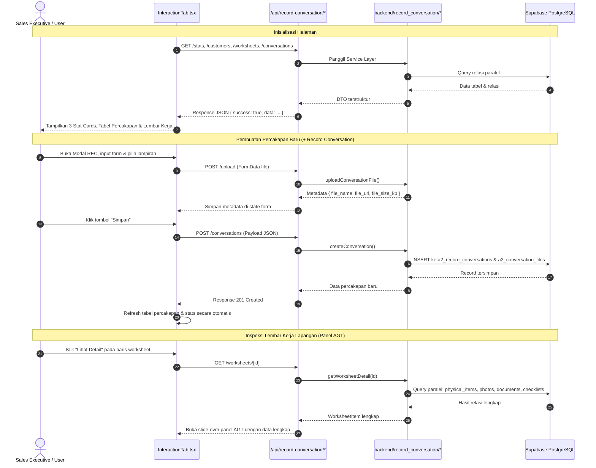

# Modul A2: Record Conversation & Field Agent Worksheets
## Dokumentasi Arsitektur & Implementasi Sistem

> **Modul**: A2 — CRM Sales Executive Dashboard (Record Conversation / Interaction Tab)  
> **Status**: Selesai & Terverifikasi (Production Ready)  
> **Versi**: 1.0.0  
> **Lokasi Source Code**:  
> - Frontend Interface: [`components/InteractionTab.tsx`](file:///c:/choirul/PISD%20A/Andima-CRM/components/InteractionTab.tsx)  
> - Backend Services: [`backend/record_conversation/`](file:///c:/choirul/PISD%20A/Andima-CRM/backend/record_conversation/)  
> - REST API Layer: [`app/api/record-conversation/`](file:///c:/choirul/PISD%20A/Andima-CRM/app/api/record-conversation/)  

---

## 1. Latar Belakang & Ringkasan Eksekutif

Modul **Record Conversation** dirancang untuk mencatat seluruh interaksi komunikasi antara Sales Executive/Dispatcher dengan pelanggan (melalui channel WhatsApp atau Meeting). Selain itu, modul ini menghubungkan komunikasi pelanggan dengan penugasan operasional lapangan melalui tabel **Field Agent Tasks & Worksheets** yang memiliki nomor acuan pekerjaan (*Job Reference Tracing*).

Seluruh sistem telah diintegrasikan secara *end-to-end* ke database **Supabase** dengan mematuhi prinsip arsitektur modular, clean code, serta mempertahankan **100% presisi visual, layout, dan styling** sesuai rancangan antarmuka Figma.

---

## 2. Struktur Arsitektur & File

```
Andima-CRM/
├── app/
│   ├── api/
│   │   └── record-conversation/              # HTTP REST API Layer (Next.js Route Handlers)
│   │       ├── stats/route.ts                # GET: Agregasi metrik kartu atas
│   │       ├── customers/route.ts            # GET: Daftar akun perusahaan pelanggan
│   │       ├── conversations/route.ts        # GET & POST: Riwayat & mutasi percakapan
│   │       ├── worksheets/route.ts           # GET: Daftar penugasan lembar kerja lapangan
│   │       ├── worksheets/[id]/route.ts      # GET: Detail 1 lembar kerja + 4 relasi anak
│   │       └── upload/route.ts               # POST: Endpoint upload berkas pendukung
│   ├── page.tsx                              # Shell CRM Dashboard utama
│   └── globals.css
├── backend/
│   └── record_conversation/                  # Core Service Layer & Business Logic
│       ├── types.ts                          # Definisi Type & Interface TypeScript DTO
│       ├── supabaseClient.ts                 # Singleton koneksi Supabase (.env.local)
│       ├── statsService.ts                   # Service agregasi metrik dashboard
│       ├── conversationService.ts            # Service query & insert percakapan pelanggan
│       ├── worksheetService.ts               # Service query lembar kerja & 4 tabel anak
│       ├── uploadService.ts                  # Service simulasi upload (siap bucket storage)
│       ├── apiClient.ts                      # Client helper pemanggil HTTP REST API
│       └── index.ts                          # Barrel export
├── components/
│   └── InteractionTab.tsx                    # Komponen antarmuka pengguna (React Client Component)
└── docs/
    ├── database/
    │   ├── FIX_SCHEMA.json                   # Skema final database referensi
    │   └── schema_database.json
    ├── dummy/                                # Seed SQL dummy data (01 s.d. 08)
    └── integration/
        ├── IMPLEMENTATION_MODULE_A2.md       # Dokumen ini (Ringkasan Implementasi)
        └── API_DOCUMENTATION.md              # Spesifikasi REST API lengkap untuk tim lain
```

---

## 3. Pemetaan Database Supabase

Seluruh tabel berada di skema `public` PostgreSQL Supabase dengan aturan relasi kunci (*Foreign Key Rules*) berikut:

| Tabel Database | Primary Key | Keterangan & Relasi Kunci |
| :--- | :--- | :--- |
| `public.a1_company_list` | `company_list_id` (`UUID`) | Master data pelanggan / perusahaan. |
| `public.d3_employee` | `id` (`UUID`) | Master data staf & PIC (Sales PIC, Field Agent). |
| `public.a2_record_conversations` | `id` (`UUID`) | Menyimpan log percakapan. FK: `customer_id` (`UUID`) & `sales_pic_id` (`UUID`). |
| `public.a2_conversation_files` | `id` (`UUID`) | Lampiran berkas percakapan. FK: `conversation_id` (`UUID`). |
| `public.a2_worksheets` | `worksheet_id` (`BIGINT`) | Data induk lembar kerja penugasan inspektur lapangan. |
| `public.a2_worksheet_physical_items` | `id` (`UUID`) | Rincian fisik kargo (Coil, Pcs, Gross Weight). FK: `worksheet_id` (`BIGINT`). |
| `public.a2_worksheet_photos` | `id` (`UUID`) | Bukti foto lapangan terverifikasi. FK: `worksheet_id` (`BIGINT`). |
| `public.a2_worksheet_documents` | `id` (`UUID`) | Dokumen pengiriman (Packing List, MSDS). FK: `worksheet_id` (`BIGINT`). |
| `public.a2_worksheet_checklists` | `id` (`UUID`) | Butir verifikasi kelayakan kargo. FK: `worksheet_id` (`BIGINT`). |

---

## 4. Alur Kerja Modul (Workflows)



---

## 5. Strategi Simulasi Upload & Transisi ke Storage Bucket

Saat ini fungsi unggah file diimplementasikan di [`uploadService.ts`](file:///c:/choirul/PISD%20A/Andima-CRM/backend/record_conversation/uploadService.ts) dan [`app/api/record-conversation/upload/route.ts`](file:///c:/choirul/PISD%20A/Andima-CRM/app/api/record-conversation/upload/route.ts) dengan pendekatan **modular simulated storage**:
1. Memproses file yang diunggah pengguna (format `.txt`, `.pdf`, `.doc`, `.docx`).
2. Menghitung ukuran file dalam KB secara akurat dan menyimulasikan latensi jaringan (300ms).
3. Mengembalikan URL publik standar yang aman untuk keperluan testing.
4. Menyimpan catatan file di tabel `public.a2_conversation_files`.

### Panduan Transisi ke Storage Bucket Asli (S3 / R2 / Supabase Storage):
Untuk mengaktifkan bucket storage asli di kemudian hari:
1. Buat bucket storage di Supabase Dashboard (misal: `conversation-attachments`).
2. Perbarui implementasi pada `uploadService.ts`:
   ```typescript
   export async function uploadToStorageBucket(bucketName: string, file: File): Promise<string> {
     const filePath = `${Date.now()}_${file.name}`;
     const { data, error } = await supabase.storage
       .from(bucketName)
       .upload(filePath, file);
     if (error) throw error;
     const { data: publicUrl } = supabase.storage.from(bucketName).getPublicUrl(filePath);
     return publicUrl.publicUrl;
   }
   ```
3. Komponen antarmuka pengguna tidak memerlukan perubahan sama sekali karena sudah menggunakan kontrak interface `UploadedFileMetadata` yang identik.

---

## 6. Fitur Pagination Server-Side (8 Item per Halaman)

Untuk menjaga performa frontend tetap ringan saat volume data bertumbuh, kedua tabel utama telah dilengkapi dengan sistem **Server-Side Pagination** (8 baris per halaman):
- **Range Query Database**: Menggunakan `.range(from, to, { count: 'exact' })` pada Supabase PostgreSQL sehingga hanya 8 baris yang ditransfer per request HTTP.
- **Keselarasan Desain UI**: Desain bar navigasi halaman (`Showing 1–8 of 20`, tombol panah `<` `>`, dan tombol nomor halaman aktif) dibuat **sama persis** dengan tab [Follow-up Tasks](file:///c:/choirul/PISD%20A/Andima-CRM/components/FollowUpTab.tsx#L73-L80).
- **Auto-Reset Filter**: Saat pengguna mengubah dropdown channel atau status, nomor halaman percakapan secara otomatis kembali ke halaman 1.

---

## 7. Fitur Job Number & Edit In-Place dengan Dirty-State Checking

Pada panel detail percakapan (Panel `VIEW` yang dibuka melalui tombol "View" di tabel Conversation):
- **Tampilan Job Number**:
  - Ditampilkan di header panel (`#AENAT/2606/0209`) dan di grid *CUSTOMER & PIC INFORMATION*.
- **Penyuntingan Atribut (In-Place Edit)**:
  - Pengguna dapat langsung memperbarui atribut:
    1. `summary` (Ringkasan catatan diskusi via textarea responsif).
    2. `channel_type` (`WhatsApp` atau `Meeting`).
    3. `urgency_level` (`High Priority`, `Average`, `Standard`).
    4. `need_assistance` (Tombol switch `Yes` / `No`).
    5. `status` (`Active` atau `Archived`).
  - Data yang bersifat audit/master tetap read-only: `Company Name`, `Customer Code`, `Job Number`, `Sales PIC`, `Conversation Date`, dan `C-Track Synchronized`.
- **Dirty-State Checking pada Tombol Simpan**:
  - Tombol **Simpan Perubahan** berstatus *disabled* dan berwarna abu-abu bila data form belum diubah (`isConvDirty === false`).
  - Begitu ada perubahan pada salah satu field, tombol otomatis aktif (`bg-blue-600 hover:bg-blue-700 text-white`) dan muncul indikator `"Perubahan Belum Disimpan"`.
  - Mutasi dikirim via `PATCH /api/record-conversation/conversations` ke Supabase, tabel percakapan langsung diperbarui di memori, pesan sukses muncul, dan tombol kembali *disabled*.

### 7.2. Perapihan Dropdown & Input Form Modal REC
- **Searchable Customer Dropdown**: Dropdown akun pelanggan menggunakan custom Tailwind dengan kotak pencarian instan (nama perusahaan, kode akun, dan job number) serta penutupan otomatis saat klik di luar.
- **Input Job Number (Opsional)**: Formulir modal REC menyediakan input nomor pekerjaan yang otomatis terisi dari akun pelanggan dan bebas diedit.
- **Channel Manual Dinamis**: Opsi Jenis Channel menyediakan kartu `Manual / Lainnya` yang memunculkan input teks kustom (misal "Telepon Langsung", "Email", dll.) dan tersimpan ke kolom `channel_type`.
- **Filter Bar Tab Utama Tailwind**: Dropdown filter *Channel Type* dan *Status* pada tab utama digantikan dengan popover Tailwind modern dengan indikator aktif.

---

## 8. Verifikasi Kualitas & Hasil Testing

1. **Static Analysis & TypeScript Checking**:
   - `pnpm build`: Berhasil 100% tanpa error (*Exit Code 0*).
   - Validasi ketat tipe TypeScript pada seluruh Route Handler, pagination DTO, dan komponen UI.
2. **Ketersediaan Route Handler**:
   - `GET /api/record-conversation/stats` — Status 200 OK
   - `GET /api/record-conversation/customers` — Status 200 OK
   - `GET /api/record-conversation/conversations?page=1&limit=8` — Status 200 OK (8 item / page)
   - `POST /api/record-conversation/conversations` — Status 201 Created
   - `PATCH /api/record-conversation/conversations` — Status 200 OK (In-Place Edit)
   - `GET /api/record-conversation/worksheets?page=1&limit=8` — Status 200 OK (8 item / page)
   - `GET /api/record-conversation/worksheets/[id]` — Status 200 OK
   - `POST /api/record-conversation/upload` — Status 200 OK
3. **Preservasi Desain UI**:
   - Seluruh badge warna (`purple`, `emerald`, `red`, `blue`, `slate`, `orange`), tipografi Inter, padding, modal responsive, slide-over panel, dan bar pagination terbukti presisi 1:1 terhadap rancangan antarmuka Figma dan tab Follow-up.

